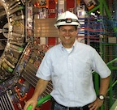

## Bio
I am a Professor in the [Department of Physics & Astronomy](https://physics.rice.edu/) at [Rice University](https://rice.edu/). My research program is in experimental particle physics, currently focused on the [CMS experiment](https://cms.cern/) at the [CERN Large Hadron Collider](https://home.cern/science/accelerators/large-hadron-collider) as well on future collider facilities.
- [Curriculum Vitae](Acosta-CV-2.pdf)

## News
- Presented the muon-ion collider concept at the [DIS 2022](https://indico.cern.ch/event/1072533/) conference in Santiago de Compostela, Spain (May 2022) 

## Research Projects
- L1 Muon Trigger of CMS
  - Endcap Muon Track-Finder [Documentation](https://github.com/jiafulow/emtf-resources-page)
- Muon-Ion Collider concept

## Recent publications
1. D. Acosta, E. Barberis, N. Hurley, W. Li, O. Miguel Colin, D. Wood, X. Zuo, “The Potential of a TeV-Scale Muon-Ion Collider”, [arXiv:2203.06258](https://arxiv.org/abs/2203.06258) (2022)
2. D. Acosta and W. Li, “A Muon-Ion Collider at BNL: the future QCD frontier and path to a new energy frontier of muon-antimuon colliders”, [Nuclear Inst. and Methods in Physics Research A 1027 (2022) 166334](https://doi.org/10.1016/j.nima.2022.166334)
3. A.M. Sirunyan et al. (CMS Collaboration), “Evidence for Higgs boson decay to a pair of muons”, [J. High Energy Phys. 01 (2021) 148](https://doi.org/10.1007/JHEP01(2021)148)
4. A.M. Sirunyan et al. (CMS Collaboration), “Performance of the CMS Level-1 trigger in proton-proton collisions at √s = 13 TeV”, [Journal of Instrumentation, 15, P10017 (2020)](https://doi.org/10.1088/1748-0221/15/10/P10017)
5. A.M. Sirunyan et al. (CMS Collaboration), “The Phase-2 Upgrade of the CMS Level-1 Trigger”, [CERN-LHCC-2020-004; CMS-TDR-021](https://cds.cern.ch/record/2714892?ln=en) 

## Physics Lectures
1. [Video lectures on Einstein's special theory of relativity](https://www.youtube.com/playlist?list=PLraSLxeuWaBq4dytL-4qSoeGkLdX2An3A)
2. [Introductory video lectures on particle physics](https://www.youtube.com/playlist?list=PLraSLxeuWaBonYBREbC8mbv6_mpIOQ50A)

## Outreach Activities
